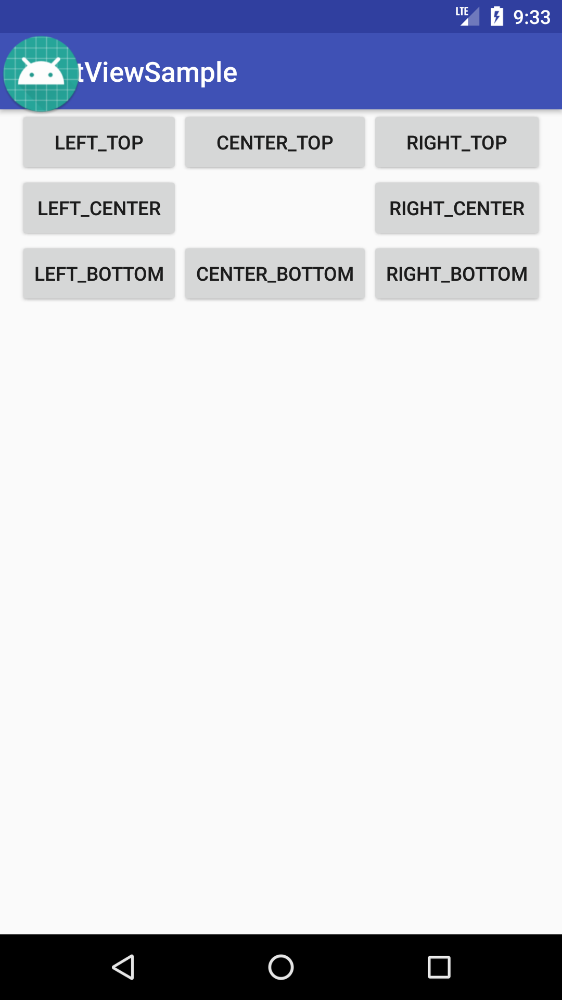

# FloatView



## Sample

```java
FloatView floatView = new FloatView(this, R.mipmap.ic_launcher_round,
        WindowManager.LayoutParams.TYPE_APPLICATION);
floatView.setOnClickListener(new View.OnClickListener() {
    @Override
    public void onClick(View v) {
        Toast.makeText(MainActivity.this, "Click!", Toast.LENGTH_SHORT).show();
    }
});
floatView.setFloatGravity(FloatGravity.LEFT_TOP);
floatView.show();
```

## LICENSE

    Copyright 2018-present, usermark

    Licensed under the Apache License, Version 2.0 (the "License");
    you may not use this file except in compliance with the License.
    You may obtain a copy of the License at

    http://www.apache.org/licenses/LICENSE-2.0

    Unless required by applicable law or agreed to in writing, software
    distributed under the License is distributed on an "AS IS" BASIS,
    WITHOUT WARRANTIES OR CONDITIONS OF ANY KIND, either express or implied.
    See the License for the specific language governing permissions and
    limitations under the License.